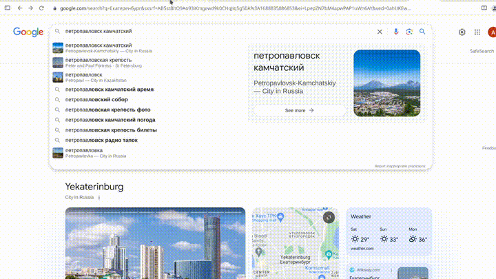

# Google2yandex maps
Думаю что многих, как и меня, бесят карты гугл. Они жутко неудобные, неинформативные, с ужасным поиском, и в последнее время не обновляются в РФ. 

Казалось бы- можно же легко пользоваться сервисами яндекса, но все таки поисковик, почта, видео, диск у гугла сильно удобнее. Это расширение интегрирует яндекс карты в гугл экосистему, и теперь, если вы нажмете maps в гугле, вас перебросит на аналогичную страницу яндекс карт

# Установка
Что бы установить это расширение, скачайте этот репозиторий, перейдите по адресу [chrome://extensions/](chrome://extensions/), затем включите Developer mode, и нажмите на появившиюсю кнопку Load Unpacked, затем выберите папку срепозиторием 
